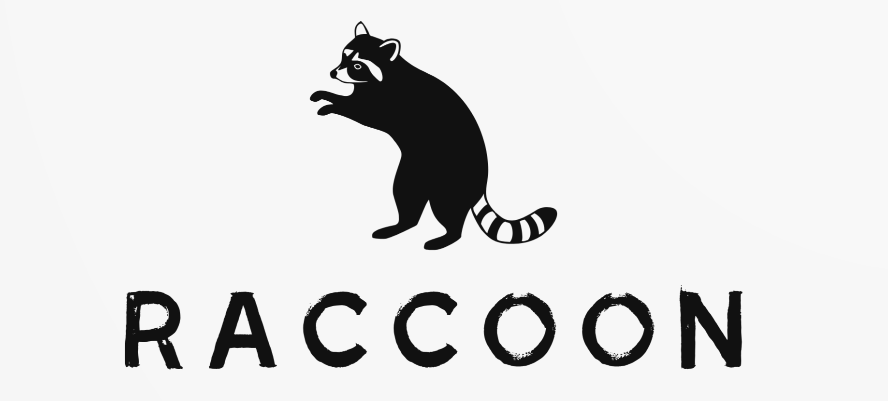

<p align="center">
  
</p>


[](https://github.com/giovanni-iannaccone/raccoon/issues)


[](https://github.com/giovanni-iannaccone/raccoon/stargazers)

# 🦝 Raccoon - PPM Image Manipulation Library

Raccoon is a lightweight and efficient C++ library for working with PPM (Portable Pixmap) image files. It allows you to easily load, modify, and create PPM images while providing a set of tools for inserting geometric shapes into your images. 
Additionally, the library comes with a handy command-line utility to make image manipulation even more accessible!
## ✨ Features
- Read PPM images: Load PPM files effortlessly into your application
- Modify Images: Perform image editing operations with ease
- Insert Geometric Shapes: Add lines, rectangles, circles, and more directly into your images
- Command-Line Utility: Use the library directly from the command line for quick tasks

> [!WARNING]
> The library is in development, everything can change at any moment

## 👨‍💻 Installation
Clone the repository:
```bash
git clone https://github.com/giovanni-iannaccone/raccoon
cd raccoon
```

## 💻 Usage 
- Library Integration <br/>
Include the library in your C++ project:
```c++
#include "raccoon.hpp"
```

- Use predefined shapes: 
```c++
RaccoonCanvas* canvas = new RaccoonCanvas(pixels, HEIGHT, WIDTH);

auto rec = new Rectangle(150, 200, 100, 200, 0xFFA1FF15);
canvas->draw(rec);
delete rec;
```

- Define your own shapes: <br/>
by using the dependency injection pattern, you can define custom shapes
```c++

class MyShape: public Drawable {

public:
  void draw(uint32_t pixels[], size_t height, size_t width) override {
    // code
  }
}

auto myshape = new MyShape();
canvas->draw(myshape);
```

## 🧃 Command Line Utility
Interact directly with PPMs using the Racccoon CLI tool:

```bash
./raccoon_cli ./outputs/raccoon_cli.ppm
```
```bash
██████╗  █████╗  ██████╗ ██████╗ ██████╗  ██████╗ ███╗   ██
██╔══██╗██╔══██╗██╔════╝██╔════╝██╔═══██╗██╔═══██╗████╗  ██║
██████╔╝███████║██║     ██║     ██║   ██║██║   ██║██╔██╗ ██║
██╔══██╗██╔══██║██║     ██║     ██║   ██║██║   ██║██║╚██╗██║
██║  ██║██║  ██║╚██████╗╚██████╗╚██████╔╝╚██████╔╝██║ ╚████║
╚═╝  ╚═╝╚═╝  ╚═╝ ╚═════╝ ╚═════╝ ╚═════╝  ╚═════╝ ╚═╝  ╚═══╝
File dimensions are 800x800
Type help to show the menu
raccoon@ppm:./outputs/raccoon_cli.ppm$
```

## 🧩 Contributing
We welcome contributions! Please follow these steps:

1. Fork the repository.
2. Create a new branch ( using <a href="https://medium.com/@abhay.pixolo/naming-conventions-for-git-branches-a-cheatsheet-8549feca2534">this</a> convention).
3. Make your changes and commit them with descriptive messages.
4. Push your changes to your fork.
5. Create a pull request to the main repository.

## ⚖️ License
This project is licensed under the GPL-3.0 License. See the LICENSE file for details.

## ⚔️ Contact
- For any inquiries or support, please contact <a href="mailto:iannacconegiovanni444@gmail.com"> iannacconegiovanni444@gmail.com </a>.
- Visit my site for more informations about me and my work <a href="https://giovanni-iannaccone.gith
ub.io" target=”_blank” rel="noopener noreferrer"> https://giovanni-iannaccone.github.io </a>

