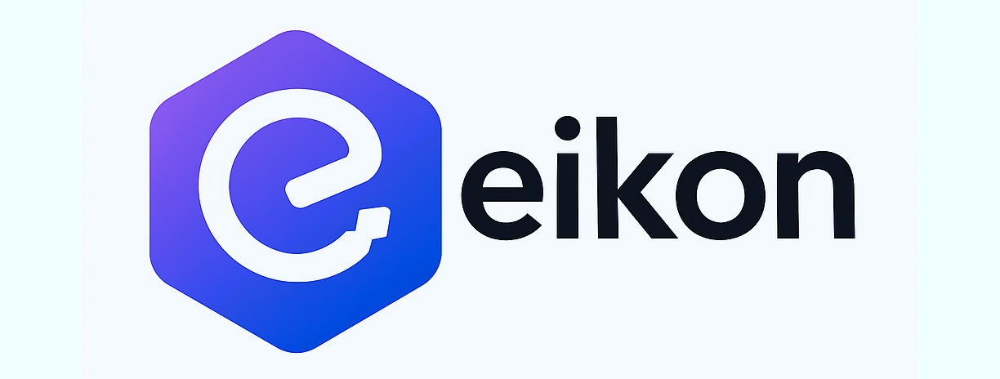
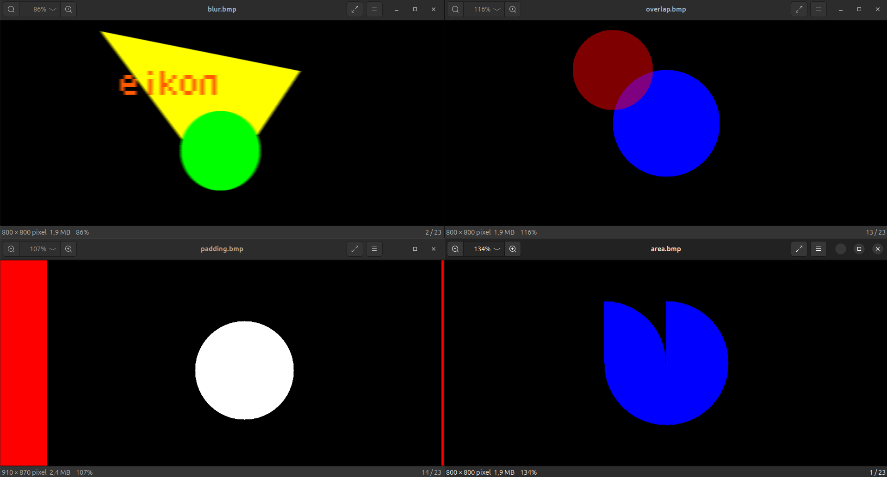
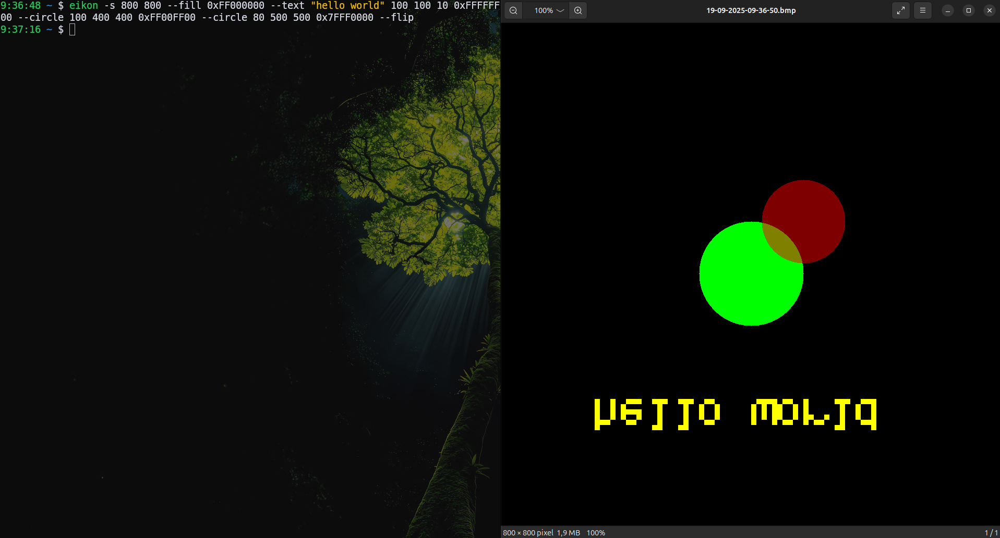

<p align="center">
  
</p>


[](https://github.com/giovanni-iannaccone/eikon/issues)


[](https://github.com/giovanni-iannaccone/eikon/stargazers)

# 🖼️ eikon - Image Processing Library

eikon is a lightweight and efficient C++ library designed for those who want to handle image files without wading through a swamp of convoluted frameworks. It lets you load, tweak, and create images effortlessly, with built-in tools for adding geometric shapes. And for command-line lovers, there's a nifty utility that makes image manipulation refreshingly straightforward.

<h3 align="center">
"Make art with code, eikon takes care of the boring stuff"
</h3>

## ✨ Features
- **Read images**: Load image files effortlessly into your application
- **Modify Images**: Perform image editing operations with ease
- **Insert Geometric Shapes**: Add lines, rectangles, circles, and more directly into your images
- **Command-Line Utility**: Use the library directly from the command line for quick tasks
- **Custom Testing Framework**: For robust and scalable image generation testing
- **Dependency-light**: Everything is implemented from scratch or is from the standard library <br/><br/>
- **Supported formats**: BMP PPM PNG 



## 📋 Requirements
- A C++ 20 compiler
- Basic knowledge of C++ and OOP

## 👨‍💻 Installation

1. Clone the repository:
```bash
git clone https://github.com/giovanni-iannaccone/eikon
cd eikon
```

2. Install the library on your system:
```bash
chmod +x build.sh
sudo ./build.sh --install
```
Follow the <a href="/docs/installation.md">installation guide</a> for detailed instructions on how to install a custom library on your system.<br/>

>[!TIP]
>Refer to the <a href="https://github.com/giovanni-iannaccone/eikon/releases/latest">latest release</a> to have a stable and fully-working version of eikon

## 🎨 Usage 
- Library Integration <br/>
Include the library in your C++ project:
```cpp
#include <eikon/eikon.hpp>
```

- Use predefined shapes <br/>
The library provides a collection of predefined shapes for use in your project:
```cpp
eikon::Canvas canvas {HEIGHT, WIDTH};

eikon::Rectangle rec {150, 200, 100, 200, 0xFFA1FF15};
canvas.draw(rec);
```

- Define your own shapes: <br/>
By using the dependency injection pattern, you can define custom shapes:
```cpp

class MyShape: public eikon::Drawable {

public:
  void draw(eikon::PixelBuffer &pixels) override {
    // code
  }
}

MyShape myshape = MyShape();
canvas.draw(myshape);
```

Refer to `./src/shapes.cpp` for the implementation details of the default shapes.

- Execute specific operations on each pixel: <br/>
Use the `map` method—modeled after Python’s `map` function—to apply a function to every pixel.
```cpp
canvas.map([](uint32_t &pixel) {
  pixel += 0xFF;
});
```

- Apply default methods to modify your image’s appearance: <br/>
Refer to the documentation to learn more about the effects, FX, enhancements, and transformations available in eikon.

- Support for CSS named colors: <br/>
eikon supports all CSS named colors. To use them, simply include:
```cpp
#include <eikon/colors.hpp>
```
You’ll then have access to the full set of CSS named colors. If they don’t suit your project, you can always define your own using hex codes.

- Linking process: <br/>
If you use eikon in your project, remember to add `-leikon` to g++'s flags.

## 🧃 Command Line Utility
1. Compile the CLI tool with cmake:
```bash
sudo ./build.sh --cli
```

2. Interact directly with images using the eikon CLI tool:
```bash
./bin/eikoncli --help
```

Read <a href="/docs/cli.md">CLI documentation</a> to know more about eikon utility tool.

>[!TIP]
> Easly convert images from one format to another
> ```bash
> eikoncli -i area.ppm -o area.bmp
> ```

3. If you want to use it from anywhere in your system, move the compiled binary to `/usr/bin` on linux or add it to your PATH on Windows:
```bash
sudo mv ./bin/eikoncli /usr/bin
```



## 👀 Who can find this helpful ?
Everybody who...
- is willing to learn a new way to create art
- has tried lots of libraries but couldn’t find one that’s easy to use
- likes building things from scratch
- is working on a big project like an image viewer or image editor

## 🤝 Community
Don’t keep your work to yourself—this community thrives on inspiration, and your project might spark someone else’s next big idea. Whether it’s polished or experimental, we’d love to see what you’ve <a href="https://github.com/giovanni-iannaccone/eikon/discussions/7">built with eikon</a>. Share your results, ask questions, give feedback, or just drop by to cheer others on. Every contribution adds to the creative energy here!

## 🔭 Learn
Read <a href="/docs/">documentation</a> to learn more about eikon implementation and how to properly use it in your C++ project.

- <a href="https://www.fileformat.info/format/bmp/egff.htm"> BMP specs </a>
- <a href="https://www.rfc-editor.org/rfc/rfc2083.html"> PNG specs </a>
- <a href="https://netpbm.sourceforge.net/doc/ppm.html"> PPM specs </a>

## 🧩 Contributing
We welcome contributing. See CONTRIBUTING.md file for details.

Please note that this project is released with a <a href="CODE_OF_CONDUCT.md">Contributor Code of Conduct</a>. By participating in this project, you agree to abide by its terms.

### Thanks to every contributor
<a href="https://github.com/giovanni-iannaccone/eikon/graphs/contributors">
  
</a>


## ⚖️ License
This project is licensed under the GPL-3.0 License. See the LICENSE file for details.

## ⚔️ Contact
- For any inquiries or support, please contact <a href="mailto:iannacconegiovanni444@gmail.com"> iannacconegiovanni444@gmail.com </a>.
- Visit my site for more informations about me and my work <a href="https://giovanni-iannaccone.github.io" target=”_blank” rel="noopener noreferrer"> https://giovanni-iannaccone.github.io </a>

